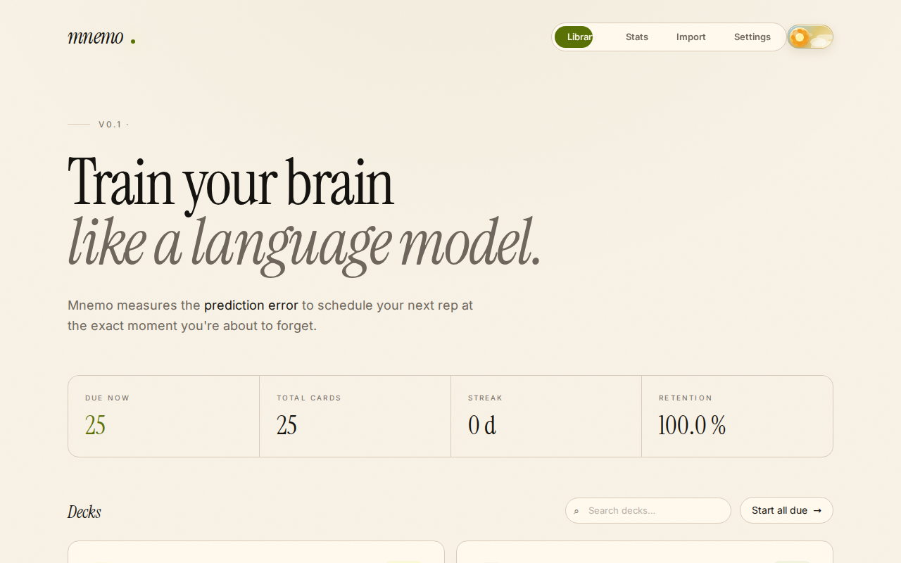
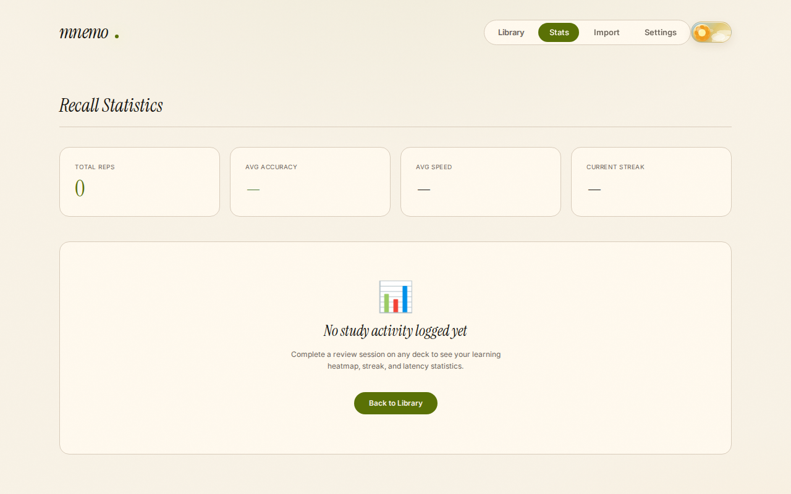
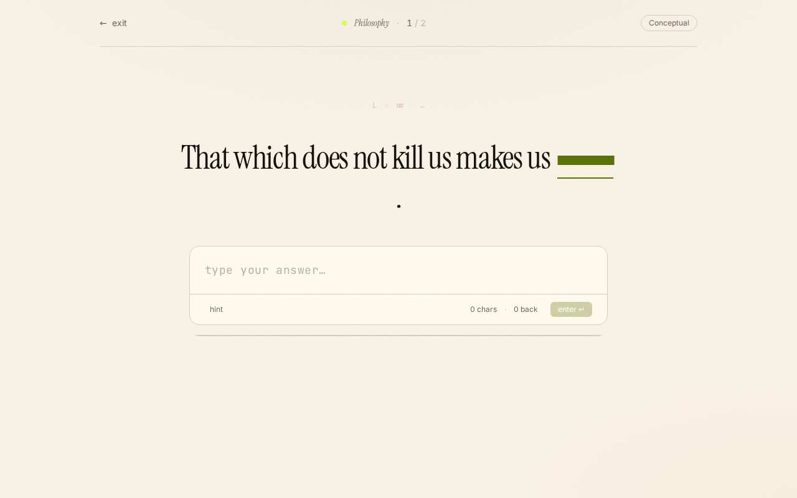

# Mnemo

Mnemo is a brain training app designed to help you learn and retain information using an advanced Spaced Repetition System (SRS).

## Screenshots

### Hub
The central library where you manage your decks and start your daily sessions.

### Stats
Detailed analytics of your learning journey, including a contribution graph and retention stats.

### Deck Detail
Manage individual cards within a deck, with options to edit, reset, or export.

## Features

- **Advanced SRS Scheduling**: Uses custom algorithms (Epoxy and SM2) to optimize your review sessions.
- **Comprehensive Stats**: Track your progress with contribution heatmaps, retention rates, and session history.
- **Customizable Decks**: Create your own decks or import/export existing ones via JSON.

## Getting Started

Since Mnemo is a single-file application, getting started is easy:

1. Clone this repository or download the `index.html` file.
2. Open `index.html` in any modern web browser.
3. Start training!

No installation or server is required.
